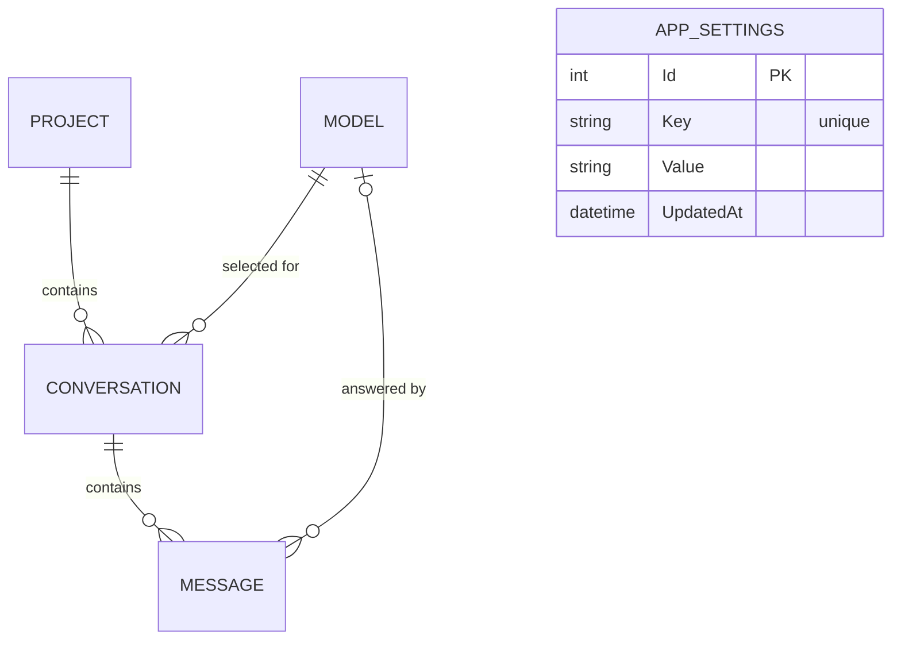

# Phase 0 spec: Local LLM chat harness

Sep 28, 2026 · @Behrooz

## Overview

Phase 0 delivers a private, single-user chat app that runs entirely on one machine: a Blazor web app (interactive server rendering) talking to a local Ollama server, with projects, conversations, messages and settings persisted in SQLite. It is the foundation that later phases (tools, file uploads, remote access) build on, so structure matters more than polish.

Name: **Tiel** (the working name was LocalChat). Target machine: a laptop with an NVIDIA T1200 (4 GB VRAM). Expect small models in the 2B to 4B range, such as Phi-4-mini or Llama 3.2 3B. The app must also run on macOS and Linux; nothing may be Windows-only.

### In scope

- Chat with a local model through Ollama, with responses streamed token by token.
- A model dropdown per conversation, listing models discovered from Ollama.
- Projects: create, rename, edit description and instructions, delete (cascades to its conversations). A built-in **General** project that cannot be deleted.
- Conversations inside a project: create, auto-title, rename, delete, and continue later with full context.
- Stop a response mid-stream; retry a response that failed.
- SQLite persistence for everything above.
- A Settings page: Ollama endpoint, default model, model list.
- Light and dark theme following the OS.
- A single-process production run: the backend serves the built UI on localhost.

### Out of scope (later phases)

- Authentication and remote or phone access.
- Tool calling, web search, file uploads, RAG.
- Regenerating a successful answer, editing earlier messages, branching.
- Moving conversations between projects, search, export.
- Context summarization (phase 0 trims old messages instead).

### How to use this spec

Save this document in the repo as `docs/phase-0-spec.md`. Claude Code works through the tasks in the **Task breakdown** section in order; each task lists its acceptance criteria. The sections before it define the contracts (schema, services, generation events, UI) that the tasks implement, and they win over any assumption.

## Tech stack and repo layout

Everything is .NET: one ASP.NET Core process hosts a Blazor Web App with interactive server rendering, and the only external runtime dependency is Ollama. There is no Node.js toolchain and no separate frontend build. Use the latest stable version of each package; the versions below are minimums.

Why interactive server rendering: components run on the server and update the browser over a SignalR connection, so they call the chat and data services directly. There is no REST API or streaming protocol to build. That is the simplest fit for a single-user app on localhost; its one trade-off, needing a live connection, matters only when remote access arrives in a later phase.

| Layer | Choice | Notes |
| --- | --- | --- |
| Inference | Ollama | Default endpoint `http://localhost:11434`. Installed separately. |
| Runtime and UI | .NET 10 SDK, Blazor Web App | Global `InteractiveServer` render mode with prerendering turned off. |
| LLM client | `Microsoft.Extensions.AI` + `OllamaSharp` | Code against `IChatClient`; `OllamaApiClient` implements it. Use `IOllamaApiClient` only for Ollama-specific calls (list models, show model). |
| Database | SQLite via EF Core 10 (`Microsoft.EntityFrameworkCore.Sqlite`) | Code-first migrations. Always `IDbContextFactory<AppDbContext>`, one context per operation. |
| UI components | Microsoft Fluent UI Blazor components | Selects, menus, dialogs, toasts; light and dark theme following the OS. |
| Markdown | Markdig | Advanced extensions on, raw HTML disabled (`DisableHtml()`), rendered as a `MarkupString`. |
| Code highlighting | highlight.js, vendored in `wwwroot/lib/highlight` | Applied through a small JS module after render. No CDN. |
| Tests | xUnit, bUnit | bUnit for components that hold logic. No paid assertion libraries. |

### How the pieces talk

- Browser to server: Blazor's SignalR connection. Components call application services in-process.
- Server to Ollama: HTTP through OllamaSharp. The browser never calls Ollama.
- A reply is generated by a server-side background task, not inside a component, so it survives navigation, reloads and closed tabs. Components subscribe to its live events (see Chat pipeline).
- JavaScript interop is limited to: code highlighting, copy to clipboard, scroll handling, and the composer's Enter key.
- One plain HTTP endpoint: `GET /api/health`, for scripts and troubleshooting.
- The app binds to `http://localhost:5080` only. Do not bind to `0.0.0.0` in phase 0; there is no authentication.

### Repo layout

```
tiel/
  docs/phase-0-spec.md
  docs/decisions.md
  Tiel.slnx
  README.md
  src/Tiel.Web/
    Program.cs
    appsettings.json
    Components/
      App.razor, Routes.razor, _Imports.razor
      Layout/      MainLayout, Sidebar, ProjectSwitcher, HealthIndicator
      Pages/       NewChat.razor, Chat.razor, Projects.razor, Settings.razor
      Chat/        MessageList, MessageView, Composer, ModelPicker
      Shared/      ConfirmDialog, ProjectDialog, InlineRename
    Data/          AppDbContext.cs, Entities/, Migrations/, Seed.cs
    Services/      OllamaClientProvider, SettingsService, HealthService, ModelSyncService,
                   ModelService, ProjectService, ConversationService, GenerationService,
                   GenerationHub, PromptBuilder, TokenEstimator, TitleService, ChangeNotifier
    wwwroot/       app.css, js/interop.js, lib/highlight/
  tests/Tiel.Web.Tests/
```

## Data model

Five tables: Project, Conversation, Message, Model, and AppSettings, a key-value table behind the Settings page so that new settings never need a migration. Deleting a project cascades to its conversations and their messages. Models are never deleted, only marked unavailable.



### Conventions (all tables)

- Primary keys are `Guid`, generated in application code with `Guid.CreateVersion7()` (time-ordered). AppSettings is the exception: an auto-increment `int Id`.
- Timestamps are `DateTime` in UTC. Do **not** use `DateTimeOffset`: the EF Core SQLite provider cannot translate it in `ORDER BY` and comparisons. Add a value converter so values read back with `DateTimeKind.Utc`.
- Enums are stored as strings (`HasConversion<string>()`).
- `UpdatedAt` is set in code on every change; there is no database trigger.

### Project

| Column | Type | Rules |
| --- | --- | --- |
| Id | Guid | PK. General uses the fixed id `00000000-0000-0000-0000-000000000001`, exposed as a constant `ProjectIds.General`. |
| Name | string | Required, 1 to 100 chars, unique (case-insensitive, `COLLATE NOCASE`). |
| Description | string? | Up to 500 chars. |
| Instructions | string? | Unlimited. Sent as a system message in every chat of this project. |
| CreatedAt, UpdatedAt | DateTime | UTC. |

### Conversation

| Column | Type | Rules |
| --- | --- | --- |
| Id | Guid | PK. |
| ProjectId | Guid | Required FK to Project, `ON DELETE CASCADE`. |
| ModelId | Guid | Required FK to Model, `ON DELETE RESTRICT`. The model selected for the next turn. |
| Title | string | Required, up to 200 chars. Starts as `New chat`. |
| SystemPrompt | string? | Optional per-chat system prompt, sent after the project instructions. |
| CreatedAt, UpdatedAt | DateTime | UTC. `UpdatedAt` is bumped on every new message, rename or model change. |

Index: `(ProjectId, UpdatedAt DESC)` for the sidebar list.

### Message

| Column | Type | Rules |
| --- | --- | --- |
| Id | Guid | PK. |
| ConversationId | Guid | Required FK to Conversation, `ON DELETE CASCADE`. |
| ModelId | Guid? | FK to Model, `ON DELETE RESTRICT`. Set on assistant messages; null on user messages. |
| Sequence | int | 1, 2, 3 … within the conversation. Unique index `(ConversationId, Sequence)`. |
| Role | enum | `User`, `Assistant`. (`System` is reserved; phase 0 never stores system messages.) |
| Content | string | Required; may be empty while streaming. |
| Status | enum | `Streaming`, `Complete`, `Cancelled`, `Error`. |
| ErrorMessage | string? | Set when Status is `Error`. |
| TokenCount | int? | Assistant messages only: Ollama's reported output token count, when available. |
| CreatedAt | DateTime | UTC. |

### Model

| Column | Type | Rules |
| --- | --- | --- |
| Id | Guid | PK. |
| Tag | string | Required, unique. The Ollama model name, for example `phi4-mini:latest`. |
| DisplayName | string | Required, up to 100 chars. Defaults to Tag; editable in Settings. |
| ContextLength | int | The context window used for requests (sent as Ollama `num_ctx`, used for trimming). Defaults to the smaller of the model's max and 4096. Editable in Settings. |
| MaxContextLength | int? | The maximum Ollama reports for the model, when known. Read-only. |
| IsAvailable | bool | False when the model is no longer installed in Ollama. |
| CreatedAt, UpdatedAt | DateTime | UTC. |

### AppSettings (key-value)

| Column | Type | Rules |
| --- | --- | --- |
| Id | int | PK, auto-increment. |
| Key | string | Required, unique, up to 100 chars. The setting's key, for example `Ollama.BaseUrl`. |
| Value | string | Required. Invariant-culture text; GUIDs in `D` format. |
| UpdatedAt | DateTime | UTC. |

Known keys in phase 0:

| Key | Value type | When absent | Meaning |
| --- | --- | --- | --- |
| `Ollama.BaseUrl` | Absolute http(s) URL | Seeded from `appsettings.json` key `Ollama:BaseUrl` | The Ollama endpoint. |
| `Chat.DefaultModelId` | GUID of a Model row | Unset | The model for new conversations. |

Rules for this table:

- Only `SettingsService` reads or writes it. Each key is defined once in code (`SettingDefinitions`): its name, parser, validator and default.
- A missing row means "use the default"; clearing a setting deletes its row. A value that fails to parse also falls back to the default, with a logged warning.
- Adding a setting later means adding a definition and a UI field. No migration.
- There is no foreign key from `Chat.DefaultModelId` to Model. The service treats a missing or unavailable model as unset.
- Values are cached in memory and the cache is cleared on every write. Each write raises a `SettingsChanged` event.

### Seeding (runs at every startup, idempotent)

1. Apply pending migrations (`Database.MigrateAsync()`).
2. If the General project does not exist, insert it with the fixed id and the name `General`.
3. If there is no `Ollama.BaseUrl` row, insert it with the value from configuration.
4. Try a model sync (see Settings). If Ollama is unreachable, log a warning and continue; the app must start without Ollama.

### Delete rules

- Project: cascades to its conversations and messages. The General project cannot be deleted (the service throws \`ConflictException\`). It can be renamed.
- Conversation: cascades to its messages.
- Model: never deleted. Sync sets `IsAvailable = false` instead, so old conversations and messages keep valid references.

## Settings

Yes, phase 0 needs a Settings page, but a small one with three parts: the Ollama connection, the default model, and the model list. The Ollama endpoint lives in the database rather than only in `appsettings.json` so it can be changed at runtime without a restart. That matters once inference moves to a bigger machine; `appsettings.json` only provides the first-run value.

### 1. Ollama connection

- A URL field showing the `Ollama.BaseUrl` setting.
- **Test connection** checks the typed URL (not yet saved) through `HealthService`. Show success with the Ollama version, or the error text.
- **Save** validates that the URL is absolute `http` or `https`, stores it, and triggers a model sync. `OllamaClientProvider` listens for `SettingsChanged` and switches to the new URL with no restart.
- The health indicator in the sidebar (green or red) checks `HealthService` every 30 seconds.

### 2. Default model

- A dropdown of available models. New conversations use it.
- If none is set, new conversations use the first available model by display name. If no model is available, the UI blocks sending and links to Settings.

### 3. Models

- A table: display name (editable), tag, context length (editable number), max context length (read-only), and an Available or Unavailable badge.
- Context length accepts 512 up to the max context length (or 131072 when the max is unknown). Show a hint that larger values use more GPU memory; on a 4 GB card, 4096 to 8192 is the practical range.
- **Sync from Ollama** runs the model sync and shows the summary (added, updated, marked unavailable).

### Model sync algorithm

1. List installed models from Ollama (OllamaSharp `ListLocalModelsAsync`).
2. For each, call show-model (`ShowModelAsync`). If the response lists capabilities and `completion` is not among them (embedding models), skip it. Read the max context from the model-info entry whose key ends in `.context_length`, when present.
3. Upsert by Tag. New rows get `DisplayName = Tag`, `ContextLength = min(max ?? 4096, 4096)`, `IsAvailable = true`. Existing rows get `IsAvailable = true` and a refreshed `MaxContextLength`; the user's display name and context length are kept.
4. Every stored model not in Ollama's list gets `IsAvailable = false`.
5. If `Chat.DefaultModelId` is unset, or points at a missing or unavailable model, and at least one model is available, set it to the first available model by display name.

### Config-only values (appsettings.json, need a restart)

| Key | Default | Purpose |
| --- | --- | --- |
| `Ollama:BaseUrl` | `http://localhost:11434` | First-run seed for `Ollama.BaseUrl`. |
| `ConnectionStrings:Tiel` | `Data Source={LocalApplicationData}/Tiel/tiel.db` | Resolve the folder with `Environment.SpecialFolder.LocalApplicationData` and create it if missing. |
| `Urls` | `http://localhost:5080` | Local-only binding. |

Deliberately **not** in settings for phase 0: temperature and other sampling options (Ollama defaults apply), theme (follows the OS), and anything about remote access.

## Application services

Components call application services directly; phase 0 has no REST API apart from `GET /api/health`. The services own every rule and validation, so components stay thin, and a REST or mobile API can be layered on the same services later without rework.

Conventions: services are registered in DI, create a fresh `AppDbContext` per operation through `IDbContextFactory`, take a `CancellationToken` on every async method, and return DTO records, never entities. Failures are typed exceptions: `ValidationException` (with field errors), `NotFoundException`, `ConflictException`, `OllamaUnavailableException`. Components catch them and show a toast or inline field errors.

### Interfaces

```csharp
public interface ISettingsService {
  Task<AppSettingsSnapshot> GetAsync(CancellationToken ct);              // typed view of all known keys
  Task SetOllamaBaseUrlAsync(string url, CancellationToken ct);           // validates, saves, raises SettingsChanged, runs a model sync
  Task SetDefaultModelAsync(Guid? modelId, CancellationToken ct);         // null clears it; the model must exist and be available
  event Action? SettingsChanged;
}

public interface IHealthService {
  Task<HealthStatus> CheckAsync(CancellationToken ct);                    // current URL, 5-second timeout
  Task<ConnectionTest> TestAsync(string baseUrl, CancellationToken ct);   // an unsaved URL
}

public interface IModelService {
  Task<IReadOnlyList<ModelDto>> ListAsync(bool includeUnavailable, CancellationToken ct); // by display name
  Task<SyncResult> SyncAsync(CancellationToken ct);
  Task<ModelDto> UpdateAsync(Guid id, string? displayName, int? contextLength, CancellationToken ct);
}

public interface IProjectService {
  Task<IReadOnlyList<ProjectDto>> ListAsync(CancellationToken ct);        // General first, then by name
  Task<ProjectDto> GetAsync(Guid id, CancellationToken ct);
  Task<ProjectDto> CreateAsync(ProjectInput input, CancellationToken ct);
  Task<ProjectDto> UpdateAsync(Guid id, ProjectInput input, CancellationToken ct);
  Task DeleteAsync(Guid id, CancellationToken ct);                        // stops active generations in its chats first
}

public interface IConversationService {
  Task<IReadOnlyList<ConversationSummary>> ListAsync(Guid projectId, CancellationToken ct); // newest UpdatedAt first
  Task<ConversationDetail> GetAsync(Guid id, CancellationToken ct);       // messages by sequence
  Task<ConversationDetail> CreateAsync(Guid projectId, Guid? modelId, CancellationToken ct);
  Task RenameAsync(Guid id, string title, CancellationToken ct);
  Task SetModelAsync(Guid id, Guid modelId, CancellationToken ct);
  Task SetSystemPromptAsync(Guid id, string? systemPrompt, CancellationToken ct);
  Task DeleteAsync(Guid id, CancellationToken ct);                        // stops an active generation first
}

public interface IGenerationService {
  Task<TurnStarted> SendAsync(Guid conversationId, string content, Guid? modelId, CancellationToken ct);
  Task<TurnStarted> RetryAsync(Guid conversationId, CancellationToken ct);
  void Stop(Guid conversationId);
  bool IsGenerating(Guid conversationId);
  GenerationSubscription Subscribe(Guid conversationId, Func<GenerationEvent, Task> onEvent); // see Chat pipeline
}
```

### DTOs

```csharp
public record AppSettingsSnapshot(string OllamaBaseUrl, Guid? DefaultModelId);
public record HealthStatus(bool OllamaReachable, string? OllamaVersion, string OllamaBaseUrl);
public record ConnectionTest(bool Ok, string? Version, string? Error);
public record ModelDto(Guid Id, string Tag, string DisplayName, int ContextLength, int? MaxContextLength, bool IsAvailable);
public record SyncResult(int Added, int Updated, int MarkedUnavailable);
public record ProjectInput(string Name, string? Description, string? Instructions);
public record ProjectDto(Guid Id, string Name, string? Description, string? Instructions,
  bool IsGeneral, int ConversationCount, DateTime CreatedAt, DateTime UpdatedAt);
public record ConversationSummary(Guid Id, Guid ProjectId, string Title, Guid ModelId, DateTime UpdatedAt);
public record ConversationDetail(Guid Id, Guid ProjectId, string Title, Guid ModelId, string? SystemPrompt,
  DateTime CreatedAt, DateTime UpdatedAt, bool IsGenerating, IReadOnlyList<MessageDto> Messages);
public record MessageDto(Guid Id, int Sequence, MessageRole Role, string Content, MessageStatus Status,
  string? ErrorMessage, Guid? ModelId, int? TokenCount, DateTime CreatedAt);
public record TurnStarted(MessageDto? UserMessage, MessageDto AssistantMessage);
```

### Rules and their errors

| Rule | Violation raises |
| --- | --- |
| Unknown project, conversation or model id | `NotFoundException` |
| Project name must be 1 to 100 chars | `ValidationException` |
| Project names are unique, case-insensitively | `ConflictException` |
| General cannot be deleted (renaming is allowed) | `ConflictException` |
| Creating a conversation needs an available model: the given one, else the default, else the first available | `ValidationException` |
| Sending to, or switching to, an unknown or unavailable model | `ValidationException` |
| Message content must be non-empty after trimming | `ValidationException` |
| Only one generation per conversation at a time | `ConflictException` |
| Retry only when the last message is an assistant message in `Error` or `Cancelled` | `ConflictException` |
| Context length must be 512 to the model's max (131072 when unknown) | `ValidationException` |
| Ollama URL must be absolute `http` or `https` | `ValidationException` |
| Sync while Ollama is unreachable | `OllamaUnavailableException` |

### Behavior notes

- Sending with a `modelId` that differs from the conversation's switches `Conversation.ModelId` first.
- Every write that touches a conversation bumps its `UpdatedAt`; every write that touches a project bumps the project's `UpdatedAt`.
- After every write, services raise events on `ChangeNotifier` (a singleton): `ProjectsChanged` and `ConversationsChanged(projectId)`. The sidebar, and any other open tab, refreshes from them.
- `GET /api/health` returns `HealthStatus` as JSON.

## Chat pipeline

The model is stateless, so every turn replays the conversation from the database: build the prompt, stream the answer, and persist the assistant message as it goes. Each reply is produced by a server-side background task that components only watch, so navigating away, reloading or closing the tab never interrupts it. An assistant row exists from the first moment, so a stop or crash never silently loses a turn.

### Generation architecture

- `GenerationService` is a singleton. It keeps a registry, `ConcurrentDictionary<Guid, ActiveGeneration>`, keyed by conversation id. Each `ActiveGeneration` holds its `CancellationTokenSource`, the text so far, the assistant message id, the trimmed-message count, a lock, and its subscribers.
- Each subscriber gets its own unbounded `Channel<GenerationEvent>` and a reader loop that calls its handler. The generator appends text and writes the event to every subscriber channel **under the generation's lock**, and `Subscribe` takes a snapshot of the text so far and registers its channel under the same lock. A late subscriber therefore sees the snapshot followed by exactly the deltas after it: no gaps, no duplicates. A slow subscriber never blocks generation.
- `Subscribe` returns a disposable `GenerationSubscription` exposing the snapshot (null when nothing is running). Components dispose it when they are disposed.
- Handlers run off the render thread. Components apply events through `InvokeAsync` and throttle `StateHasChanged` to at most 20 renders per second.
- Only three things stop a generation: `Stop`, deleting its conversation or project, and app shutdown. On `ApplicationStopping`, cancel every active generation so each ends as `Cancelled`.
- All database work in the background task uses `IDbContextFactory`, never a component's or request's context.

### Events

| Event | Data | When |
| --- | --- | --- |
| `GenerationStarted` | `UserMessage?`, `AssistantMessage`, `TrimmedMessages` | Once, first. |
| `GenerationDelta` | `Text` | Per chunk of generated text. |
| `GenerationCompleted` | `Message` (status `Complete` or `Cancelled`) | When the reply ends normally or is stopped. |
| `TitleGenerated` | `Title` | After completion, only when a title was generated. |
| `GenerationFailed` | `Message` (status `Error`) | On failure. Final event. |

### Turn lifecycle (`SendAsync`)

In the caller:

1. Validate: the conversation exists, `content` is non-empty after trimming, and the model (the given one or the conversation's) exists and is available. Register an `ActiveGeneration`; if one exists, throw `ConflictException`.
2. In one transaction: insert the user message (`Sequence = max + 1`, status `Complete`), insert the assistant message (`Sequence = max + 2`, status `Streaming`, empty content, `ModelId` set), switch `Conversation.ModelId` if needed, bump `UpdatedAt`. Commit.
3. Start the background task and return `TurnStarted` immediately.

In the background task:

4. Build the prompt with `PromptBuilder` (below) and publish `GenerationStarted`.
5. Call `IChatClient.GetStreamingResponseAsync` with the model's Tag and `num_ctx = Model.ContextLength`, using the generation's token. For each update with text: append and publish `GenerationDelta`. Save the partial content to the assistant row at most every 2 seconds.
6. On completion: save the full content, status `Complete`, and `TokenCount` from the usage details when Ollama reports them. Bump `UpdatedAt`. Publish `GenerationCompleted` and raise `ConversationsChanged`.
7. If this was the conversation's first assistant reply and the title is still `New chat`, generate a title (below), save it, publish `TitleGenerated`, and raise `ConversationsChanged`.
8. On cancellation: save the partial content with status `Cancelled`, using `CancellationToken.None` for the save. Publish `GenerationCompleted`.
9. On any other failure (Ollama unreachable, model missing, timeout): save status `Error` with a short, human-readable `ErrorMessage`, and publish `GenerationFailed`. Log the full exception.
10. Always remove the generation from the registry and complete its subscriber channels in a `finally` block.

At startup, after seeding, mark any message still in status `Streaming` as `Error` with the message `Interrupted: the app stopped during generation.`

**Passing `num_ctx`:** check how OllamaSharp's `IChatClient` implementation accepts Ollama options (typically through `ChatOptions.AdditionalProperties`). If it cannot, use `IOllamaApiClient.ChatAsync` with request options for this call and keep the rest of the pipeline the same. Verify with a test that the value reaches Ollama.

### Retry (`RetryAsync`)

Allowed only when the last message is an assistant message with status `Error` or `Cancelled`. Delete that message, then run the lifecycle without inserting a user message. The new assistant message takes the next sequence number, and `UserMessage` is null in `TurnStarted` and `GenerationStarted`.

### Prompt assembly (`PromptBuilder`, a pure function)

1. **System message:** the project `Instructions` and the conversation `SystemPrompt`, whichever are non-empty, joined by a blank line into one system message. Small models handle one system message more reliably than two. Omit it if both are empty.
2. **History:** earlier messages in sequence order. Include `Complete` messages, and `Cancelled` messages with non-empty content. Skip `Error` messages and empty ones.
3. **Latest user message:** always last.

### Context trimming

- Budget = `ContextLength − min(1024, ContextLength / 4)`; the reserved part leaves room for the answer.
- Token estimate per message = `ceil(chars / 3.5) + 4` (`TokenEstimator`). This is deliberately conservative; there is no tokenizer in phase 0.
- Always keep the system message and the latest user message. Drop the oldest history messages one at a time until the estimate fits. If the kept messages alone exceed the budget, send them anyway and log a warning.
- Trimming affects only the request, never the database. Report the number of dropped messages in `GenerationStarted.TrimmedMessages` so the UI can show a notice.

### Title generation (`TitleService`)

- A non-streaming call to the same model, with a 20-second timeout. System: `You write short titles for chat conversations.` User: `Write a title of at most 6 words for a conversation that starts with the message below. Reply with the title only.` followed by the first 1,000 characters of the first user message.
- Clean the output: take the first non-empty line, strip a leading `Title:`, quotes, asterisks and trailing punctuation, collapse whitespace, cap at 60 characters.
- If the call fails or the result is empty, fall back to the first 50 characters of the user message plus `…` when cut.

## Blazor UI

One layout with a left sidebar (project switcher and chat list) and a main area (chat, projects or settings), built from Razor components with Fluent UI. It should feel like a familiar chat UI: clean, fast and keyboard-friendly.

### Routes

| Route | Component | Shows |
| --- | --- | --- |
| `/` | `Home` | Redirects to the last-used project (remembered per browser), or General. |
| `/p/{ProjectId:guid}` | `NewChat` | New chat in that project: empty state, model picker, composer. |
| `/c/{ConversationId:guid}` | `Chat` | An existing conversation. |
| `/projects` | `Projects` | Manage projects. |
| `/settings` | `Settings` | Settings. |

Set the render mode once in `App.razor`: `InteractiveServer` with prerendering off, so each component initializes once and there is no static-render pass to reconcile.

### Layout

- **Sidebar** (about 280 px; a drawer behind a menu button below 768 px wide):
  - App name and the Ollama health indicator.
  - Project switcher: a dropdown of projects plus a `Manage projects` link.
  - `New chat` button, which goes to `/p/{ProjectId}`.
  - The current project's conversations, newest first: title and relative time, the active one highlighted. A menu on each offers Rename (inline edit) and Delete (confirmation dialog).
  - `Settings` link at the bottom.
  - Refreshes on `ChangeNotifier` events, so titles and ordering update live.
- **Chat header:** the title (click to rename inline) and the model picker.
- **Message list** and **composer** below it.

### Chat behavior

- **Messages:** user messages as right-aligned bubbles; assistant messages full width, rendered from markdown with Markdig. Code blocks get highlight.js, a language label and a Copy button (clipboard via JS). Links open in a new tab with `rel="noopener noreferrer"`. Raw HTML is never rendered.
- **Streaming:** text appears as it arrives, with a typing indicator. Highlight code only once a message is final, to keep streaming renders cheap.
- **Live view:** on load, `Chat` fetches the conversation and subscribes to its generation. If a reply is in progress (after a reload, or when returning to the chat), it shows the snapshot and continues live.
- **Auto-scroll:** stick to the bottom while streaming, unless the user has scrolled up more than 80 px. Then show a `Jump to latest` button.
- **Composer:** an auto-growing textarea (up to about 10 lines). Enter sends; Shift+Enter adds a newline. A small JS listener handles the keys, because Blazor cannot cancel the default Enter behavior conditionally. While generating, the Send button becomes **Stop**, which calls `GenerationService.Stop`.
- **Errors and stops:** an `Error` message shows its `ErrorMessage` in a red-bordered bubble; a `Cancelled` message shows its partial text with a `Stopped` label. If either is the last message, it has a **Retry** button.
- **Trimmed context:** when `TrimmedMessages > 0`, show a subtle note above the composer: `N earlier messages are outside this model's context window.`
- **Unavailable model:** if the conversation's model is unavailable, show a banner and disable sending until another model is picked.

### New chat flow

1. `NewChat` shows the composer with the model picker preset to the default model.
2. On the first send: `ConversationService.CreateAsync` with the chosen model, then `GenerationService.SendAsync`, then navigate to `/c/{id}`.
3. Generation already runs server-side, so `Chat` simply subscribes on arrival and picks up the stream from its snapshot. No client-side stream state is needed.
4. On `TitleGenerated`, update the header; the sidebar updates from `ChangeNotifier`.

### Model picker

A dropdown of available models by display name. In an existing conversation, a change calls `ConversationService.SetModelAsync`. In `NewChat` it is local state until the first send.

### Projects page

- A list of projects: name, description, conversation count, last updated. General shows a `Default` badge and has no Delete action.
- `New project` and `Edit` open the same dialog: name, description, and instructions (a large textarea with a hint that instructions apply to every chat in the project). Field errors from `ValidationException` show inline.
- Delete opens a confirmation that states the cost: `This permanently deletes the project and its N conversations.`
- Clicking a project goes to `/p/{ProjectId}`.

### Settings page

Implements the three parts described in the Settings section.

### UI plumbing

- Components that subscribe to `ChangeNotifier`, `SettingsService` or a generation implement `IDisposable` and unsubscribe on dispose.
- Service exceptions surface as toasts; an `ErrorBoundary` around the main area catches anything unexpected.
- Customize the reconnect UI with a short, calm message; the default retention period is fine.
- `wwwroot/js/interop.js` holds all JavaScript: highlight, copy, scroll helpers, composer keys.
- Theme follows the OS through Fluent UI's design tokens. Icon-only buttons have `aria-label`s, and focus outlines stay visible.

## Task breakdown

Fourteen tasks, in order: T0 is manual setup, T1 to T8 build and test the services, T9 to T12 build the UI, and T13 packages it. Each task ends with checkable acceptance criteria; finish and commit one task before starting the next.

### T0. Prerequisites (done by hand)

- Install the .NET 10 SDK, a current NVIDIA driver, and Ollama. Node.js is not needed.
- Pull two small models: `ollama pull phi4-mini` and `ollama pull llama3.2:3b`.
- Run `ollama run phi4-mini "hello"`, then `ollama ps`, and confirm the model runs on the GPU.
- Create the git repo.

Done when:

- [ ] `dotnet --version` reports 10.x.
- [ ] `curl http://localhost:11434/api/tags` lists both models.

### T1. Repo scaffold

- Create the layout from **Tech stack and repo layout**: `dotnet new blazor --interactivity Server --all-interactive` as `Tiel.Web`, an xUnit test project with bUnit, and the solution.
- Turn prerendering off in `App.razor`. Add Fluent UI Blazor and replace the template's pages with an empty `MainLayout`.
- `Directory.Build.props`: nullable enabled, implicit usings, warnings as errors.
- Add `.gitignore` (including `*.db`) and `.editorconfig`.
- Bind to `http://localhost:5080`; add `GET /api/health` returning a stub.

Done when:

- [ ] `dotnet build` and `dotnet test` pass.
- [ ] `dotnet run` serves an empty layout at `http://localhost:5080`, and `/api/health` returns JSON.

### T2. Data layer

- Entities, `AppDbContext` and configuration exactly as in **Data model**: keys, lengths, unique indexes, `COLLATE NOCASE`, FK delete behaviors, UTC converter, string enums. Register `IDbContextFactory<AppDbContext>`.
- Initial migration `InitialCreate`.
- Resolve the database path from `ConnectionStrings:Tiel` and create the folder.
- Startup seeding and the stale-`Streaming` fix.

Done when (integration tests on a real SQLite file):

- [ ] Migrations apply to an empty database.
- [ ] Starting twice leaves exactly one General project and one `Ollama.BaseUrl` row.
- [ ] Deleting a project deletes its conversations and messages.
- [ ] Unique rules hold: project names regardless of case, `(ConversationId, Sequence)`, and the settings key.

### T3. Settings, Ollama client and health

- `SettingsService` with `SettingDefinitions`, the in-memory cache and `SettingsChanged`.
- `OllamaClientProvider` (singleton): returns an `IChatClient` and an `IOllamaApiClient` for the current `Ollama.BaseUrl`, caches them per URL, and resets on `SettingsChanged`. Put it behind an interface so tests can inject fakes.
- Streaming calls have no overall timeout; health and connection tests time out after 5 seconds.
- `HealthService`, and `/api/health` wired to it.

Done when:

- [ ] Tests: a missing row returns the default; an unparseable value returns the default and logs; clearing deletes the row; a write clears the cache and raises the event; a bad URL throws `ValidationException`.
- [ ] Changing the URL makes the next Ollama call use it, without a restart.
- [ ] With Ollama stopped, the app starts, health reports unreachable, and nothing crashes.

### T4. Models

- `ModelSyncService` (the **Model sync algorithm**) and `ModelService`.

Done when:

- [ ] Unit tests with a fake client cover: a new model added with defaults, the user's display name and context length kept on re-sync, a missing model marked unavailable, an embedding model skipped, and the default model set when unset or invalid.
- [ ] Context length outside 512 to max throws `ValidationException`.
- [ ] With Ollama running, a sync lists the pulled models.

### T5. Projects

Done when (`ProjectService` tests against SQLite):

- [ ] Create, read, update and delete work, and the list is ordered General first, then by name.
- [ ] `ConversationCount` is correct.
- [ ] Duplicate names throw `ConflictException`, case-insensitively.
- [ ] Deleting General throws `ConflictException`; renaming it succeeds.
- [ ] Writes raise `ProjectsChanged`.

### T6. Conversations

Done when (`ConversationService` tests):

- [ ] Creating without a model uses the default, or the first available one; with no available model it throws `ValidationException`.
- [ ] The list is ordered by `UpdatedAt`, newest first, and rename and model changes bump `UpdatedAt`.
- [ ] Switching to an unavailable model throws `ValidationException`.
- [ ] `GetAsync` returns messages in sequence order.

### T7. Prompt builder and trimming

- `PromptBuilder` and `TokenEstimator` as pure classes, per **Chat pipeline**.

Done when (unit tests):

- [ ] Instructions and system prompt merge into one system message; either may be absent.
- [ ] `Error` and empty messages are skipped; non-empty `Cancelled` ones are kept.
- [ ] Trimming drops the oldest history first, always keeps the system message and latest user message, and reports the dropped count.

### T8. Generation service

- Registry, background task, per-subscriber channels, `Stop`, `RetryAsync`, `TitleService`, and cancellation on shutdown.

Done when (tests with a fake `IChatClient` that streams canned chunks and can be told to fail or hang):

- [ ] Events arrive in order: `GenerationStarted`, deltas, `GenerationCompleted`, then `TitleGenerated` on the first turn. The assistant row ends `Complete` with the full text.
- [ ] A subscriber that joins mid-stream sees the snapshot plus later deltas, adding up to exactly the final text.
- [ ] `Stop` leaves the row `Cancelled` with the partial text; disposing a subscription does not stop generation.
- [ ] A client exception leaves the row `Error` and publishes `GenerationFailed`.
- [ ] A second send while one is running throws `ConflictException`.
- [ ] Retry works only after `Error` or `Cancelled`, and replaces that message.
- [ ] A failing title call falls back to the truncated first message.
- [ ] Shutdown cancels active generations and they end `Cancelled`.
- [ ] `num_ctx` reaches Ollama (manual check or a recorded request).

### T9. UI foundation

- Fluent UI setup and theme, `MainLayout` with the sidebar shell, `HealthIndicator`, toasts, `ErrorBoundary`, the reconnect UI, and `interop.js`. Vendor highlight.js into `wwwroot/lib/highlight`.

Done when:

- [ ] The shell renders correctly in light and dark mode, and at phone width.
- [ ] The health indicator turns red within 30 seconds of stopping Ollama and green after starting it.

### T10. Sidebar and projects

- Project switcher, conversation list with rename and delete, the Projects page with its dialogs.

Done when:

- [ ] Projects can be created, edited and deleted from the UI, and the sidebar updates without a reload.
- [ ] General has no Delete action, and the delete dialog states how many conversations will be removed.
- [ ] bUnit tests cover the project dialog's validation display.

### T11. Chat view

- Everything in **Chat behavior**, **New chat flow** and **Model picker**.

Done when:

- [ ] A new chat streams its first answer, then gets an auto-title in the header and sidebar.
- [ ] Stop, Retry, auto-scroll with `Jump to latest`, and the trimmed-context note all work.
- [ ] Code blocks are highlighted and copyable.
- [ ] Navigating away and back during a reply, or reloading, shows the reply continuing live.
- [ ] bUnit tests cover `MessageView` for each status (`Streaming`, `Complete`, `Cancelled`, `Error`).

### T12. Settings page

Done when:

- [ ] The Ollama URL can be tested and saved, and the health indicator follows it.
- [ ] Sync, display name edits and context length edits persist.
- [ ] A new chat starts with the chosen default model.

### T13. Publish and README

- `dotnet publish -c Release` produces a self-contained folder for the current OS.
- README: prerequisites, how to run in development, how to publish and run, where the database lives, and how to reset it.

Done when:

- [ ] On a clean clone, publishing and running the output serves the full app at `http://localhost:5080`, and deep links like `/c/{id}` work on refresh.

## Definition of done

Phase 0 is done when all task criteria pass and this end-to-end walkthrough works on the target laptop, using the published build:

- [ ] Fresh start with no database: the app opens on General with an empty chat list and the model picker preset.
- [ ] Send a message: the answer streams, then the chat gets an auto-title in the header and sidebar.
- [ ] Send a follow-up that depends on the first answer ("make it shorter"); the model clearly has the context.
- [ ] Switch the model mid-chat and send again; the new answer is produced by the new model, and both answers keep their own model.
- [ ] Stop a long answer: the partial text stays, marked `Stopped`, with Retry.
- [ ] Close the tab while an answer streams, then reopen the chat: the answer is still streaming or already complete.
- [ ] Stop Ollama and send: the error is shown with Retry. Start Ollama and retry: it succeeds.
- [ ] Create a project with instructions ("Always answer in French"); chats in it follow them, and General chats do not.
- [ ] Rename and delete chats; rename a project; delete a project and confirm its chats are gone.
- [ ] Restart the app: every project, chat and message is still there, and continuing an old chat keeps its context.
- [ ] Change the context length of a model in Settings, then have a long chat; the trimmed-context note appears and the app keeps working.
- [ ] Point Settings at a wrong URL: the health indicator turns red and Test connection shows the error. Point it back: green again, without restarting.

## Instructions for Claude Code

Work through the tasks in order, one at a time, and treat this spec as the source of truth. When the spec is silent or ambiguous, choose the simplest option that fits it, note the decision in `docs/decisions.md`, and continue; stop and ask only when a choice would change the schema, the service interfaces or the generation events.

- **One task per commit.** Before committing, run `dotnet build` and `dotnet test`; both must pass. Commit messages start with the task id, for example `T5: projects`.
- **Verify libraries, don't guess.** Check the current documentation for Blazor in .NET 10, Microsoft.Extensions.AI, OllamaSharp, EF Core 10, Fluent UI Blazor, Markdig and bUnit before using an API. Prefer the latest stable versions.
- **Keep the layers clean.** Components stay thin; rules live in `Services/`; `PromptBuilder` and `TokenEstimator` stay pure. Code against `IChatClient` so the inference backend can be swapped later.
- **Blazor Server rules:** never inject `AppDbContext` into a component (use the services, which use `IDbContextFactory`); marshal background events with `InvokeAsync`; unsubscribe from every event on dispose; keep slow work off the render path; use JavaScript only for the cases listed in the tech stack.
- **Settings go through `SettingsService` only.** A new setting is a new entry in `SettingDefinitions`, never a new column.
- **Test at the right level.** Unit tests for pure logic, service tests against a temporary SQLite file, bUnit for components with logic. Tests must never require a running Ollama; use fakes behind the client provider interface.
- **C# style:** file-scoped namespaces, records for DTOs, `async` all the way down with `CancellationToken` on every I/O call, no `.Result` or `.Wait()`.
- **Privacy defaults are requirements.** Bind to localhost only, send nothing to any service other than the configured Ollama endpoint, and add no telemetry, analytics or CDN-loaded assets.
- **Don't build ahead.** No authentication, tools, uploads, REST API or remote access in phase 0, even as stubs. Schema changes beyond this spec need a note in `docs/decisions.md`.
- **Report at the end of each task:** what was built, what was tested, and anything that deviates from this spec.
